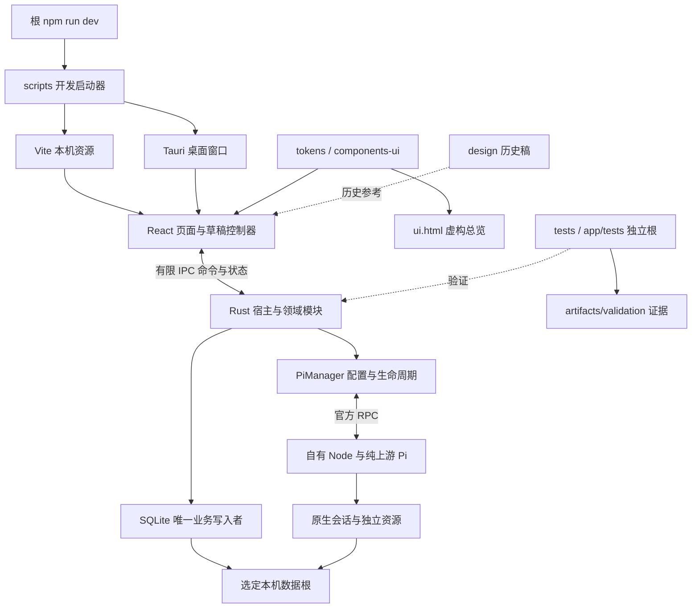

# AZCine 项目架构

> 更新：2026-10-08。目录名英文、职责中文；只说明实际结构与技术边界，不代表功能已验收。结构变化局部更新，进度只见开发计划。

## 1. 目录树

```text
_AZCine/
├── AGENTS.md                 # 长期规则
├── README.md                 # 运行入口
├── index.html                # UI总览入口：离线说明＋当前Worktree开发服务，不是生产应用
├── package.json              # 根级开发/检查命令
├── rust-toolchain.toml       # 项目Rust版本
├── .gitignore                # 源码与运行产物边界
├── app/                      # 真实桌面应用，详见下树
├── docs/                     # 五份产品核心文档，与根两份共七份
│   ├── requirements.md       # 范围、决定、验收和六类状态
│   ├── design-spec.md        # 视觉与交互
│   ├── development-plan.md   # 顺序、依赖与状态
│   ├── project-architecture.md # 本文件
│   └── current-work.md       # 当前授权/暂停点
├── design/                   # HTML/CSS/JS参考及虚构演示，不放截图
├── assets/brand/             # 原始完整字标、派生素材与短出处说明
├── research/                 # 原始参考与历史路径映射，不是日常任务入口
│   ├── references/           # AIHOT/Arena/技术资料/用户界面参考副本
│   ├── project-references/   # 产品比较来源，子README仅出处
│   └── migration/            # 冻结旧路径→新路径/大小/哈希
├── scripts/                  # 自动环境联接/端口/实例启动、退出状态、项目内工具链安装
├── tests/                    # 当前验证脚本
│   └── support/              # 浏览器/窗口操作/显式fixture/检查器
├── artifacts/
│   ├── previews/             # 少量精选展示图
│   └── validation/<run-id>/  # 库/附件/截图/日志/失败样本/原始报告
├── archive/                  # 冻结历史，排除后续自动读取和更新
│   ├── documents-<run-id>/   # 文档原件与路径/字节清单，不是任务清单
│   ├── project-rules/        # 此前规则原件
│   ├── design-v1/            # 被替代的设计
│   ├── project-table-v2/     # 旧项目模型
│   ├── ui-pre-card-revision/ # 卡片改版前副本
│   └── evidence/             # 旧验证和迁移前快照
├── .tooling/                 # 本机Rust/Cargo/下载/npm/WebView缓存
└── .git/                     # 版本控制元数据，不是用户数据
```

```text
app/
├── index.html / ui.html      # 生产React载入页 / 独立组件与页面总览
├── components.json           # shadcn组件别名与样式配置
├── ui-inventory.ts / ui-preview-server.ts # TSX清单/当前Worktree总览地址
├── package.json / package-lock.json # 前端/Tauri依赖及精确锁
├── tsconfig.json / vite.config.ts   # 类型与开发构建
├── src/
│   ├── main.tsx / App.tsx    # 启动、壳、导航及页面控制器
│   ├── routes.ts            # 正常页与项目文档定位
│   ├── *-panels.tsx         # 待办/公司/聊天/设置页面组件
│   ├── use-*.ts             # 草稿、状态及异步操作
│   ├── *-contract.ts        # 实际数据校验与领域边界
│   ├── project-operations.ts # 块/行/列/清单事项删除撤销及指定list语义列
│   ├── project-checklist-panel.tsx # 左侧项目级清单分组、事项与完成显示
│   ├── project-stage-picker.tsx / project-add-menu.tsx # 阶段选择/新增管理与内容锚定浮层
│   ├── project-list-editor.tsx / project-table-operations.ts # 表格与行列操作
│   ├── table-menu.tsx       # 行列/清单分组锚定短菜单
│   ├── use-anchored-popover.ts # top-layer定位、裁切区域检测与滚动响应
│   ├── date-input.tsx / calendar.ts # 项目/待办共用日历和纯日期计算
│   ├── pi-client.ts / pi-messages.ts # IPC客户端与消息展示
│   ├── pi-agent-panel.tsx / pi-process-panel.tsx / pi-process-view.ts # 聊天壳/过程UI/纯投影；已合main并统一UI库
│   ├── model-ranking-contract.ts / model-ranking-source.ts # 双榜快照校验与公开数据获取
│   ├── model-ranking-prices.ts # Models.dev模型匹配及报价
│   ├── use-model-ranking.ts / model-ranking-panel.tsx # App持有状态、取数与榜单显示
│   ├── ideas-contract.ts / use-ideas.ts / ideas-panels.tsx # 灵感契约、逐卡草稿与防重转换
│   ├── bookkeeping-contract.ts / use-bookkeeping.ts / bookkeeping-panels.tsx # 开销、报价快照、报销与表单草稿
│   ├── news-*.ts / news-*-panels.tsx / use-news*.ts # 采集/编辑、阅读、规则和刊期状态
│   ├── components/ui/       # 通用组件、业务变体和统一控件CSS
│   ├── lib/utils.ts         # cn/类名合并
│   ├── lib/display-path.ts  # Windows路径显示归一，真实IPC路径不改
│   ├── ui-preview/          # 场景清单/虚构控制器/状态交互/源码展示
│   ├── styles/              # globals唯一入口、tokens亮暗变量与模块布局
│   └── assets/              # 生产引用的受控资源
├── src-tauri/
│   ├── Cargo.toml / Cargo.lock # Rust配置与锁
│   ├── tauri.conf.json / build.rs # 桌面配置与权限生成
│   ├── src/
│   │   ├── main.rs / lib.rs  # 宿主入口、模块、状态与有限IPC注册
│   │   ├── storage.rs        # 根目录/独占锁/SQLite/待办
│   │   ├── projects.rs       # 公司文档/修订/CAS事务
│   │   ├── ideas.rs          # 灵感修订/请求回执/软删除/待办关联事务
│   │   ├── bookkeeping.rs / bookkeeping-commands.rs / bookkeeping-exchange.rs # 记账事务、有限IPC与外币报价
│   │   ├── news-*.rs         # 信源/HTTP/RSS/采集、独立Pi整理、刊期/PDF及本地调度
│   │   ├── model-ranking.rs / model-ranking-commands.rs # 模型榜事务存储与有限IPC
│   │   ├── native_paths.rs / diagnostics.rs # 原生路径与临时诊断
│   │   ├── pi-manager.rs / pi-commands.rs # 生命周期与有限命令
│   │   ├── pi-runtime.rs / pi-launch-plan.rs # 原版资源校验/独立环境
│   │   ├── pi-owned-process.rs # Windows自有Job/子树/管道
│   │   ├── pi-jsonl.rs / pi-rpc.rs # 字节协议/请求关联
│   │   ├── pi-model-config.rs / pi-config-store.rs # 原生模型与文件事务
│   │   ├── pi-provider-config.rs / pi-model-discovery.rs # 服务商配置/受控模型列表获取
│   │   ├── pi-resources.rs  # 资源预览/受限写入及SDK辅助进程
│   │   ├── pi-sessions.rs / pi-projection.rs # 原生会话与状态投影
│   │   ├── pi-redactor.rs    # 应用内已知秘密脱敏
│   │   └── *-tests.rs        # 领域/Manager/会话专项测试
│   ├── resources/news-sources.json # 固定18个预置信源
│   ├── resources/news-prompts/ # 打包AIHOT规则/分类/许可
│   ├── resources/pi-resource-inspector.mjs # 应用侧原版SDK inspector，不patch Pi
│   ├── capabilities/        # 窗口能力集合
│   ├── permissions/autogenerated/ # 编译生成的命令权限，不手改业务
│   ├── gen/schemas/         # Tauri生成schema
│   ├── icons/               # 桌面图标
│   └── target/              # 编译缓存/调试产物
├── resources/
│   ├── runtime-lock.json    # Node/Pi官方来源/版本/完整性
│   └── runtime/<runtime-id>/ # 自有Node与原版Pi/锁定依赖，不共享宿主
├── tests/                   # 前端契约/纯逻辑/路由测试
├── node_modules/            # 锁文件安装结果
└── dist/                    # 前端构建输出
```

页面/领域组件仍在 `src/`；通用零件已集中在实际 `src/components/ui/`，总览在 `src/ui-preview/`，不虚构 `pages/` 或 `app/pi/`。依赖/runtime内部、验证run与历史不递归展开；可重建缓存不等于已授权清理。

## 2. 调用关系



Rust写正式业务库，Pi写自己的原生会话；AI输出在应用外部校验成草案，本人核对后才事务更新。React不直写SQLite，设计稿不进入生产执行链。实际字段/命令以 `lib.rs`、`pi-commands.rs` 和TS/Rust契约代码为准，本文不另抄一套接口。

Agent `feat/agent-design` 的12a5c89＋06a2251已由29ef06e合入main。`App`仍持有`usePi`的草稿/回执；控制器持有展示选择、会话/代次滚动记忆及观测到的运行起点，不写原生会话。`pi-process-view`仅适配已脱敏快照，用实际调用ID合并消息与事件，保正文顺序、孤立/重复ID和异常标识；`pi-process-panel`渲染独立展开项，`pi-agent-panel`承接聊天布局/滚动/输入，`pi-panels`保留模型设置与RuntimeInfo。Agent的Rust改动仅收窄调用ID前缀裁切：原子字符串ID按完整秘密脱敏，非原子子树和正文仍保留流式前缀保护；未修改原版Pi、RPC协议、数据库或依赖。

开发展示另由 `pi-agent-panel` 在 `import.meta.env.DEV` 下显式懒加载 `pi-agent-demo.tsx`，复用同一个 `AgentChat`/过程渲染。示例控制器、三段虚构会话、四种状态与三个示例模型全部在React内存中，不调用IPC/模型/存储；App持有的真实usePi控制器与草稿保留，退出示例重新显示。此补充已随06a2251合入main，最新界面未重验。

## 3. 用户数据根（不是源码根）

默认系统文档目录 `AZCineData`，可选；不表示默认根已在用户机器创建。目录由对应模块初始化，预留目录不代表功能接通。

```text
<选定数据根>/
├── .azcine.lock              # 当前根独占运行锁，位于根而不是db内
├── db/                       # 正式业务SQLite
├── attachments/              # 主动导入副本
├── snapshots/                # 资讯/Arena版本快照
├── config/                   # 非凭据业务配置
├── logs/                     # 脱敏任务日志
├── backups/                  # S13完整包
└── pi/
    ├── agent/                # 原生配置/认证/用户添加Skills扩展等
    ├── sessions/             # 原生JSONL会话，不用SQL聊天表代替
    ├── private-config-transactions/ # 配置恢复片段，可能含认证，排除备份
    ├── workspaces/default/   # 应用默认受控cwd
    ├── home/                 # 独立HOME/USERPROFILE
    ├── appdata/              # 独立APPDATA
    ├── localappdata/          # 独立LOCALAPPDATA
    └── temp/                 # Pi独立临时区
```

定位配置仅在本机指向根；程序runtime/可重建缓存不属于业务包。备份/迁移要协调业务与原生会话写入，排除认证/Key/私有事务和递归backups。测试根只在各validation run，不读取/覆盖真实根。

## 4. 已有模块的关键技术约束

这些是代码维护必须保留的边界，非阶段通过声明。具体格式、限额、版本以当前代码/锁为准，变更同轮只修相关段。

### 业务与编辑

SQLite单业务写入者、根锁；当前统一schema 16；v6文章/原文/步骤回执与刊期、v7范围/待处理标记、v8清空请求回执、v9记账、v10外币字段、v11项目删除/请求、v12处理历史隐藏；v13～v16 Agent/任务/会话与待办软删除见下节。`storage.rs` 按实际模块表组区分main v1/v2、灵感v3、资讯采集v3与编辑v4及后续版本，只校验对应旧版已有表，再在同一事务补齐缺失模块并推进版本；部分/歧义/未知结构拒绝，不降低版本或重建旧库。本轮未执行实际迁移，新版升级共享库后旧schema12及更早程序不能打开。稳定项目/块/行/阶段ID，公司修订与CAS整批事务。一个镜头一行，日期/阶段/交完互不自动联动，只有指定list派生。分页不裁持久数据，异步回执不覆盖后续草稿，撤销消耗一次、冲突有明确反馈。

`App.tsx` / `styles/app.css` 维护窗口高度内的固定外壳：标题栏、导航、模块标题不随正文滚动，普通模块使用 `workspace-scroll`。项目详情由 `projects-panels.tsx` / `styles/projects.css` 使用全宽 `project-document`，顶部操作固定，`project-checklists-scroll` 与 `project-document-scroll` 分别滚动；详情外层 `workspace-scroll--project-document` 不再滚正文，窄窗口清单可收起/容器内展开，不影响其他模块业务。

项目清单仍是同一 `ProjectContent.blocks` 内的 `kind:'checklist'`，没有另建待办表或更换业务存储结构。`projects-panels.tsx` 按kind拆分显示，检查清单交给 `project-checklist-panel.tsx`，文字/list留在右侧；保留已有块/事项ID与内容，显示分组/正文各自排序，保存仍走 `use-projects.ts` 和既有Rust项目CAS事务。清单不自动同步今天，不参与镜头交付推断。

`projects-contract.ts` 增加 `deleteChecklistItem` 和内存 `ProjectUndo` 的 `kind:'checklist-item'`，保留事项快照与相邻位置，`restoreUndo` 校验后恢复；`project-operations.ts` 的 `removeEntity` 路由到这一删除类型。沿用项目级单次撤销和保存失败保留策略，不把新增UI删除操作绕成前端直写SQLite。

项目阶段/添加内容/表格与清单短菜单及共用日历使用 `use-anchored-popover.ts` 的原生top-layer浮层，保留DOM子树的键盘/失焦关系，不参与表格行高；定位会检查 `list-scroll`、`project-document-scroll`、`project-checklists-scroll`、`workspace-scroll` 的裁切区域，响应内部滚动，触发控件离开可见区域时关闭。阶段新增/管理/改名在 `project-stage-picker.tsx` 的同一浮层内切换，父项目控制器处理标签与当前行值；标签色相仅为显示样式，不改变业务ID或日期/交完语义。保存中结构锁仍由控制器与事件捕获共同阻断，临时 `aria-disabled` 保焦点和稳定调色；文本草稿仍按所属项目保留，不用消闪取消并发保护。

`project-list-editor.tsx` 负责分页、单元格键盘、行列拖动与列宽预览，纯操作在 `project-table-operations.ts`，不重建行列ID或转换单元格语义。`fitColumnWidths` 按测得的容器宽度拟合显示列宽，达到可读最小宽度后才局部横滚；表格内部纵滚/固定表头与统一list容器由样式维护，不新增列分组功能。列宽作为可选字段跟随公司JSON文档保存；旧列不含宽度仍合法，TS/Rust都校验112–640整数。`tauri.conf.json` 的 `dragDropEnabled:false` 关闭WebView2被Tauri替换的内部拖放处理，使Windows HTML5行列拖动工作；不是禁用表内拖动或宣称附件导入已实现。

`date-input.tsx` 为项目和待办共用输入/浮动月历，`calendar.ts` 用UTC日期作纯公历偏移，今天取既有本地日期函数；不猜不完整输入年份。项目选择日按原项目保存、待办选择只更新新增草稿。今天等待不卸载已有事项/表单，失败保旧记录，正式数据仍由Rust写入。

项目整文档删除独立于文档内部撤销：`projects.rs` 的删除标记/请求表经 `project_catalog`、`set_project_deleted`、`project_deletion_request` IPC接入 `use-projects.ts`。软删除退出汇总，已删除列表可恢复；文档、关联和草稿保留，修订与请求幂等保护旧撤销不覆盖新变更。

### 记账

`App`持有 `use-bookkeeping.ts`，表单与列表通过 `bookkeeping-contract.ts` 校验，经 `bookkeeping_list`、`bookkeeping_mutate`、`bookkeeping_request` 进入 `bookkeeping-commands.rs` 与 `bookkeeping.rs` 的Rust事务；票据添加/打开、CSV导出及报价各有有限IPC，命令在lib.rs/build.rs/main白名单登记。请求回执、修订冲突及软删除沿用保输入策略，不由前端直写库。

`bookkeeping-exchange.rs` 通过 `news-http.rs` 获取Frankfurter的ECB报价，绑定币种/请求日期并保存实际报价日期/来源、原币金额与人民币结果；金额以整数最小单位及十进制比例处理，不用浮点累计。票据复制到业务根、原件不改，系统文件选择/打开与CSV保存由 `native_paths.rs` 承接。当前真实网络、票据、导出和迁移均未验证。

### 模型榜与开发实例

`App.tsx` 持有 `use-model-ranking.ts`，请求和反馈跨路由/主题保留；`model-ranking-source.ts` 通过固定Hugging Face Dataset Viewer读取Arena发布数据，`model-ranking-prices.ts` 从固定Models.dev JSON匹配Agent报价，前端不直写业务库。Rust `model-ranking.rs` 在既有 `app_meta` 的 `ranking-auto:<board>:` 命名空间保存不可变SHA256快照、当前指针及每日尝试；完整校验后事务提交，预期数据根/快照ID防止过期写入，无新增编号迁移。四项有限IPC经 `model-ranking-commands.rs` 注册，`native_paths.rs` 只打开两个固定Arena页面，CSP仅增加实际公开来源域名。

`scripts/dev-environment.mjs` 根据Git common目录定位主环境，逐资源组区分独立目录、共享链接与缺失资源；仅复用main的组比对工具链/Cargo锁、Node声明/锁或runtime锁，并按白名单准备缺失联接。独立目录使用自身匹配环境，不覆盖已有目录；外部资源链接、上级目录联接或共享版本不符明确失败。`scripts/run-desktop.mjs` 动态检测本机端口，启动独立Vite、等待真实地址就绪并有限重试，生成本机Tauri devUrl/CSP覆盖。`.tooling/instance/launcher.lock` 防同目录重复启动，`run-state.json` 记录自有PID/路径/端口/退出结果；只停止所启动的PID树，调试端口显式启用。

正常 `scripts/run-desktop.mjs dev` 为自有子进程标记使用原main业务数据；debug宿主通过本机应用原定位配置读取统一业务根，不再初始化分支业务库，缺定位/库占用时失败、不回退空库。`prepareEnvironment`从Git common-dir返回main根；正常开发传 `AZCINE_DEV_PI_DATA_DIR=<main>/.tooling/dev-instance/data`，`PiPaths::prepare`仅在debug且非unit-test、无显式测试根时使用其 `pi/`。原版Pi配置/认证/会话/用户资源共用main自有根，资讯专用Pi复用这份模型配置；不读取任何外部Pi/宿主认证，不自动迁移分支旧文件。缺共享参数报错。WebView使用实例webview，Vite缓存使用 `.tooling/vite-cache/`。明确测试config/default根覆盖仍保持原隔离行为；正式版本不接受开发环境覆盖。启动状态区分业务data与piData并报告模式；不入Git，不写死本机源码/业务路径。业务定位调整fd96230与Pi共享调整4affaf8均已合main，未运行新验证；旧独立库/Pi目录运行证据不覆盖当前共享入口。

### 灵感与资讯

灵感控制器在App持有新增和各卡草稿、请求回执与版本冲突核对。Rust `ideas.rs` 事务保存/软删除/撤销，转换只创建一次无日期待办并保留双向编号；`routes.ts` 分别解析资讯信源目标与灵感/今天来源UUID，互不覆盖。

资讯采集由Rust HTTP/RSS/Atom模块在Store锁外取得有界输入，保存来源快照/材料/去重及任务状态。`news-ai.rs` 使用应用自有原版Pi的独立进程及本机配置，在进程外校验模型结果；不操作自由Agent会话。编辑存储保留不可变刊期及可重试输入；屏幕/复制/Windows WebView2 PDF共用完整有序文本。`news-schedule.rs` 只在本应用运行时按启用配置触发采集/北京时间日报，默认关闭；不是通用队列、托盘或系统自启。

### 原版runtime、环境与进程

- 当前源码锁为独立Node24.21.0 / 上游Pi1.0.4；main自有资源已替换为1.0.4，旧0.99.1运行目录按用户要求删除。官方包来源/hash以runtime-lock为准，本轮核对归档文件与部署复制哈希，仅属安装完整性；不patch核心或改默认系统提示。用户明确授权的auto-session-title扩展由pi-session-title.rs一次安装到本应用根，用户修改/移除优先；不是Pi核心补丁。资源路径显式，不执行PATH中的其他Pi。
- 启动环境显式构造自有HOME/USERPROFILE/APPDATA/LOCALAPPDATA/TEMP、Node路径和agent/session配置；不继承宿主认证、配置指针、Key环境、模块注入。资源发现排除外部来源需实证，不称OS沙箱。
- 外部cwd先核上游启动迁移/资源发现，可能存在旧 `.pi/commands` 的路径不能默认启动或读取/修改外部资料；受控workspace优先，任意外部cwd能力未保证。
- Windows使用 `CreateProcessW` 的原子 `PROC_THREAD_ATTRIBUTE_JOB_LIST` / `HANDLE_LIST` 与overlapped父管道，Job `KILL_ON_JOB_CLOSE` 控制自有子树；不依靠普通Command启动后再Assign的竞态窗口，不按名称kill。兼容项目Rust1.99。
- Manager异步运行与业务Store锁分开，有限IPC带generation/sequence防旧事件回写；停止不是长时间锁住业务保存。进程退出、父提前死亡和句柄/管道关闭需实际验证。

### RPC与状态投影

官方LF-only JSONL，按字节缓冲拆行，保留分段UTF-8与合法U+2028/2029，不用通用splitlines误切；单帧有界（当前图片扩容后的上限见 `pi-image-limits.rs`）。请求ID严格关联，错ID/EOF/超时/协议错误使受影响等待正确失败，不自动重发或盲恢复副作用。

accepted/handled只代表接受，不是业务完成；终态结合settled状态与最后assistant消息，不能单凭 `agent_end` 或普通disposition报成功。会话/运行generation归属正确，工具/流/停止/错误按真实事件投影。

### 原生会话

原生v3文件和active branch是恢复来源，不从SQL重建假会话；只扫描自有canonical根，拒绝外部路径，解析有界（文件/行上限由 `pi-image-limits.rs` 统一，最多5000个候选文件、目录深度4）。超限/坏文件明确失败，不静默截断或扫描其他Pi。RPC/TUI交接必须同配置并移交所有权，一次一写入者，完整交接属S04。

### 配置保存与脱敏

- 原生models/settings保留JSON注释和未知字段；认证引用遵守严格格式，应用输入的字面 `$` 用 `$$` 规则转义，不执行输入命令。Key写入不回显、空值保留原值；保存与重新连接是不同动作。
- 配置prepared事务/恢复记录在自有私有目录，提交前冲突检测；中断可继续/拒绝，不截断原文件，不丢未知字段。此目录可能含认证，不能进入普通日志/分享/备份。
- 脱敏只用应用内已知秘密，不为扫描读取宿主凭据；stdout/stderr/错误映射不泄露原始header/Key/base64认证或未筛原始响应。当前字段与恢复行为以代码为准。

### 统一前端与总览

`main.tsx`和 `ui-preview/main.tsx` 同引 `styles/globals.css`，Tailwind 4层与data-theme映射由该入口管理；精确依赖以package/lock为准。通用组件皮肤位于 `components/ui/`，页面CSS负责作用域内布局。`WorkspaceHeader`使用Tauri实际窗口API和有限权限；总览不调用真实桌面操作。前端维护规则只在设计规范第1节，不在此重复数值。

根 `index.html`读取本Worktree忽略的 `.tooling/ui-preview-url.js`，校对iframe来源与Worktree标识后接入本机 `/ui.html`；无服务只显示说明。总览复用 `WorkspaceView`、生产组件与明确fixture，原 `desktop-api.ts` 的preview边界阻止真实IPC。`catalog.ts`登记场景/来源/状态，`state-actions.ts`承担展示交互；`ui-inventory.ts`枚举TSX控件和条件，未登记提示并非测试/自动完整覆盖。

`components/ui/form-dialog.tsx` 统一创建与开销编辑容器，保留关闭过渡内容和弹窗会话归属；`month-input.tsx` 提供中文月份。`operation-toast.tsx` 由控制器发布通知、WorkspaceHeader挂载唯一展示实例，通过Portal定位并处理替换/计时/暂停/撤销。`globals.css` 统一导入控件和记账布局，总览使用内存fixture；通知/表单规则数值只维护于设计规范。

### polish资讯链与资源基础

`news-prompts.rs`读取打包规则/分类和上游来源标识，模板与分类参与prompt hash；`news-pipeline.rs`经原版Pi执行内容理解/结构/预筛/评分/归组/中文整理，`news-reader-store.rs`保存原文、文章、步骤回执和缓存、阅读标记，`news-reader-editions.rs`保存固定报告，`news-reader-export.rs`提供Markdown导出。React统一阅读路由为 `news/items` / `news/stories`，旧事件链接转统一详情；旧日报/PDF实现保留，不因旧技术结果证明新reader链通过。

`news-scope.rs`维护范围及待处理排除标记，`news-reset.rs`只操作资讯表与自有快照，预览指纹/幂等请求/占用锁/事务及暂存恢复保护现有记录。新增history/history:<uuid>范围以 `news_hidden_runs` 移除历史可见性，保留结果、快照与去重信息；实际任务锁内拒绝移除运行中任务或重试已隐藏记录，前端news-history-changed事件清理对应详情。历史隐藏在v12；当前schema16新增迁移未运行，不读取或改真实库，本轮没有执行清空或采集。

### Agent MCP、业务草案与限定后台（2026-10-07已合main）

主要源码：Rust的 `agent-runtime.rs` / `agent-store.rs` / `agent-commands.rs` 保存输入绑定、草案/附件/任务与确认回执；`agent-modules.rs` 注册projects/today/ideas/bookkeeping/news/models的ModuleProvider目录/快照/版本/动作schema/校验/事务，新增模块需提供对应真实实现。`agent-mcp.rs` / `agent-mcp-tools.rs` 与 `resources/azcine-mcp-server.mjs` 提供19项工具；`agent-jobs.rs` 提供summarize-text/summarize-batch/draft-objects限定任务、日志/输出/取消。

链路为页面捕获每次输入来源/对象/附件 → 官方Pi RPC与原生MCP客户端 → 应用自有Node stdio服务 → 127.0.0.1临时端口Rust服务 → provider/既有事务。grant绑定会话/任务、根与generation，失效连接拒绝；仅维护应用拥有的azcine配置条目并保用户其他设置。MCP检索/读取无需手选所有对象，prepare_changes只保存草案，界面核对原对象版本后整批事务应用；幂等requestKey与applied回执区分建议和正式保存。业务字段协议由MCP提供，pi-rules.rs仅按固定hash将旧应用模板保副本退出加载，用户改过的规则保留。

数据库源码为16：v13 Agent持久记录，v14任务ordinal/context_objects，v15会话软删除/原生路径屏蔽，v16待办软删除；同事务推进版本。原生会话文件仍是历史来源，删除不删JSONL。原库本轮未打开/迁移，升级后schema12及更早程序拒绝读取，其他Worktree需按授权同步兼容代码。后台独立临时配置禁资源发现，草案任务才开放MCP；不等于任意任务/原版spawn或关机调度。

React的 `use-pi.ts` / `use-agent-*.ts` 和Agent面板共用长寿命控制器：切模块仅更新下一次来源，按2026-10-08决定自动连接；根/会话/epoch/generation/seq保护迟到回执。Pi空闲600秒释放、resident配额为回复上限+2，活动/等待受保护；投影缓存目标8个/约128MiB也保护当前/忙碌输入，非整体内存硬上限。正文/元数据合并，资源仅其页面按需加载并缓存30秒。父ID与nestedCalls在pi-projection.rs白名单投影，pi-process-view.ts按父链去重归组；异常/孤立事件保留。

`scripts/launcher-lock.mjs` 核对PID/创建时间处理失效锁，无法确认则保留，不按名称结束进程；隔离验证启动状态/target/cache与正常开发分开。以上结构已合入62c93dc，runtime已部署并核对安装完整性，MCP/任务/迁移/生命周期真实运行未验证。

工具 `resources`由 `PiResourcesPanel`与长寿命 `usePi`中的 `use-pi-resources`状态承接。有限IPC经PiManager操作锁进入 `pi-resources.rs`，自有Node辅助进程执行应用侧inspector，导入已安装上游SDK的SettingsManager/DefaultPackageManager/loadSkills/buildSystemPrompt；不创建Agent、不执行扩展工厂、不调用模型、不安装缺包。官方默认提示词是只读预览，命令注册仅代表可确认范围。

`use-pi-resources.ts` 复用进行中的读取Promise，对短暂pi_busy/pi_cancelled有限退避，写入不自动重试；保存锁和失效回执检查保草稿。`lib/display-path.ts` 只在显示层隐藏Windows扩展路径前缀并处理UNC，IPC与文件操作使用原生路径。

规则/Skill写入限制在agent/受控workspace、单文件128KB、拒绝链接/越界、对hash核对并临时文件发布；扩展源码只读，启停通过原版FileSettingsStorage原生锁内hash核对更新extensions并保其他配置。保存不自动重连。SDK辅助进程实际运行、Windows路径、并发锁、真实保存均未验证；`--no-context-files`仍限制AGENTS自动注入，完整TUI留待，基础select/confirm/input/editor响应已接但未验证。

### 仓库任务面板（2026-10-07合入kanban-dev）

前端由 `use-task-panel.ts` / `use-task-panel-workflow.ts`、`task-panel-*.tsx` 与 `styles/task-panel.css` 承接，App/route/同库globals和UI预览已与Agent接入合并。Rust的 `task-panel-workspace.rs` / locations / consolidation / legacy定位Git common-dir总仓库和实际执行Worktree，权威任务库为总仓库 `.azcine/task-panel/state.sqlite3`（application_id `0x415A5450`、独立版本1），执行目录映射到 `.azcine/worktrees/`，交接物料在task-panel/tasks/<id>/runs。旧库归并有备份/保原库/保ID/编号冲突事件；不是源码合并就执行数据归并。

`task-panel-store.rs` / types / projects / context / snapshots / evidence / recovery持久化修订/依赖/来源/请求、快照哈希、执行/技术检查/本人验收与确认记忆。`herdr-adapter.rs` / execution / launch / monitor通过本机已有Herdr CLI观察、精确绑定和操作已批准的执行窗格，PowerShell分别启动codex/opi；未知/过期不推断完成。Agent access/intake、应用 `resources/task-panel-cli.mjs` 与graph contract提供任务范围的查询/候选回填，显式词法索引并非完整Tree-sitter或独立Codex App Server；调用关系为候选，执行图与代码图分层关联来源。退出同时保留Pi清理和task-panel接入关闭。

兼容共同业务库的 `storage-branch-schema.rs` 按表/列结构区分任务旧13/14与Agent13～16，合并后全局保持16，任务表另记app_meta.task_panel_schema=14；初始化/迁移同事务创建缺少模块并验证。旧任务13/14不能跳过Agent建表/待办软删除，Agent16不能重跑13/14迁移；不降级/重建库，独立仓库任务库不混用这套版本。相关旧fixture和版本断言已随合并调整但未运行，真实库/任务归并/窗格/模型本轮未操作。

任务面板后续修订由 `task-panel-create-dialog.tsx` / `use-task-refinement.ts` 通过已配置模型、独立Agent绑定与选定仓库调用Pi；`pi-resources.rs` / `pi-launch-plan.rs` 按用户明确决定提供 `app/resources/skills/task-refine/SKILL.md` 到应用自有Skills目录，保用户修改，用安装标记避免删除后自动恢复，不改上游核心/默认提示。上下文只是有限项目资料，代码结论仍需实际读仓库；不等于OS沙箱。

`task-panel-collaboration.rs` / `use-task-panel-drafts.ts` 使用任务库app_meta保存意见、每仓库编辑草稿与部分创建记录；projects/store支持项目软删除/恢复，无新schema版本。新增IPC `task_panel_feedback`、`task_panel_drafts`、`task_panel_draft`，CLI提供feedback/acknowledge_feedback及稳定请求ID。通知核对原generation/server/pane/agent/cwd且可交互，不确定发送不盲重试；release_for_revision先核对停止再建新修订。单执行目录失败单独报告workspaceError，不拖垮全列表。

内容/记录/意见分别在 `task-panel-task-content.tsx`、`task-panel-task-records.tsx`、`task-panel-feedback.tsx`；graph-layout/graph及控制器保项目范围、图层和分页，普通执行图在分页前排除技术对象。evidence按检查身份/覆盖/日志哈希/代码指纹判断当前证据，顶层user_confirmed决定本人必做门槛，不能由Agent的detail伪造；acknowledge_unverified只记录本人接受未验证结果，不改技术检查状态或下游技术门槛。旧回执不自动升级，新代码需重启后端生效；合并不操作现存授权/运行绑定。

### 服务器和凭证

`App.tsx` / `routes.ts` → `server-credentials-panel.tsx` → `use-server-credentials.ts` → Rust `server-credentials.rs`，契约/日期在 `server-credentials-contract.ts`，布局在 `styles/server-credentials.css`；`server-credentials-demo.ts` 仅供显式UI预览。共用分页在 `components/ui/record-pagination.tsx`，组件变体与总览沿用现有目录。

Rust的load/save/receipt/add_file/open_folder五个 `server_credentials_*` 命令通过build/lib/capabilities注册，验证主窗口和当前根，复用Store写入锁。模块以 `app_meta.server_credentials_schema=1` 附加建表，不提高全局schema16或改任务模块标记；`server_credentials_state` 保存revision/JSON快照，requests保存幂等请求/指纹，files保存文件名/大小/哈希。读写均检查字段/日期/关联，修订条件更新和回执同事务；清红点仍写整份快照，尚未拆分接口。

用户选择的文件复制到数据根 `attachments/credentials/<uuid>/key-<原文件名>`，1字节至1MB；打开目录按ID查库后核对路径、大小和哈希。删除记录/取消关联保副本和原件。密码及副本无本模块额外静态加密，不新增解锁流程。服务器/凭证各最多10000条、续费历史100000条、写入序列化上限32MiB；限额不代表真实大数据性能已验证。

### 开发环境打包与部署

工具路由 → `dev-environment-panel.tsx` / `use-dev-environment.ts` → `dev-environment-client.ts` → `src-tauri/src/dev-environment.rs` 的inspect/status/export/cancel/open五个 `dev_environment_*` IPC → 内嵌 `src-tauri/resources/dev-environment/` 的common/inspect/export/deploy/start-environment PowerShell脚本。EnvironmentState保存任务进度和自身子进程句柄，应用退出调用shutdown；不写业务库、不增加schema/依赖，不替换应用自有Pi/runtime。

导出读取所选当前Herdr/OpenPI和运行依赖，排除已知认证/会话/项目/缓存，结构化配置处理凭据和已知路径；生成 `dev-environment.zip` / `skills-manager.zip` 及文件清单。环境包包含独立deploy.cmd，先校验再恢复到所选目录，冲突拒绝覆盖；恢复Shell入口和快捷方式，PATH仅作用于子进程，不改全局PATH或系统执行策略。Skills保隐藏项/空目录、链接由用户建立，Codex只附安装命令；取消/失败保未完成标记。

该模块导出的是用户选定的外部开发环境，与AZCine自身原版Pi隔离规则分开；不修改源宿主配置或核心，也不宣称配置转换覆盖任意外部服务/自定义路径。`app/tests/dev-environment-integration.py` / boundaries.py保存隔离验证脚本；前端总览fixture不执行真实文件操作。

### 项目图片、Agent与资讯后续修订（dd2785d）

项目行payload增加可选images映射关联现有列；`project-images.rs` 的project_import_image/project_image_preview由Rust写 `attachments/projects` 副本，读取核对大小/类型/SHA256，无schema版本迁移。`project-cell-images.tsx` / imports / list-editor接选图/粘贴/拖入；ImageViewer/ExpandableTextCell复用到项目/附件/文章，原件不改。

`agent-session-navigation.tsx` / `use-agent-data.ts` 保存会话重命名，agent-store将草案验证失败落blocked/conflict并保原因；新信源草案必须暂停。`use-pi.ts` 自动连接与状态保护，provider-advanced/pi-thinking及Rust provider-config保存完整推理映射/默认强度；不改变上游核心/默认提示，实际模型支持另验。

`news-daily-panel.tsx` / daily及 `news/daily[/id]` 路由恢复日报、复制/Markdown导出和今天看点，保08:00固定窗口与同日版本，不自动处理所有材料。content/feed/http识别聚合链接/实体/媒体与摘要，`news-browser.rs` / extract.js在独立取文窗口读取公开DOM，无法取得全文保摘要/公开节选与原因；`run-desktop.mjs` 仅为主窗口设置dataDirectory，不再用进程级WebView目录覆盖取文窗口。

`news-pipeline.rs` / news-ai在应用层按2/5/10秒最多追加3次临时错误重试，逐次记录步骤/额度，取消优先；Pi原生重试关闭，坏进程先释放再按原模型连接，写库/格式/认证/配置/额度错误不自动重试。材料不足保待补并继续，手动恢复复用回执及原配置。article-body/news-body-markdown只在展示层合并开头作者与邻接控件，历史存储/复制导出不改。BrandLogo与assets/brands保原色资源及许可清单。旧原库恢复/清空任务已取消，不调用其历史脚本。

## 5. 文档与路径维护

目录/职责/调用关系变更时只更新本图相关节点；功能细节或测试数字不反复改架构。新增模块区分实际/计划，不以图宣称已实现。

旧迁移 `research/migration/path-map.json` 和快照哈希不改。本次文档迁移单独保存 `archive/documents-<run-id>/manifest.json`，记录原路径、归档路径、copy/move、大小和SHA；现有布局脚本仅解析move重定位，不读旧文档正文。归档文件不自动修链接或恢复成执行入口。
