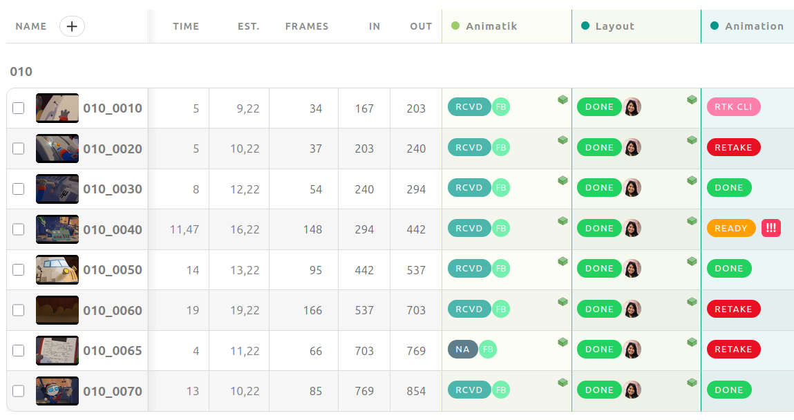
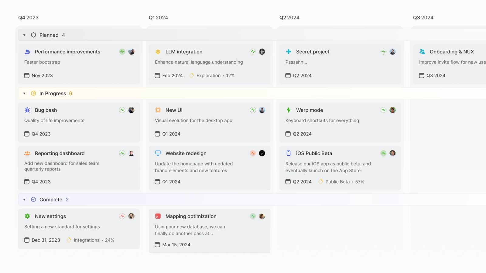
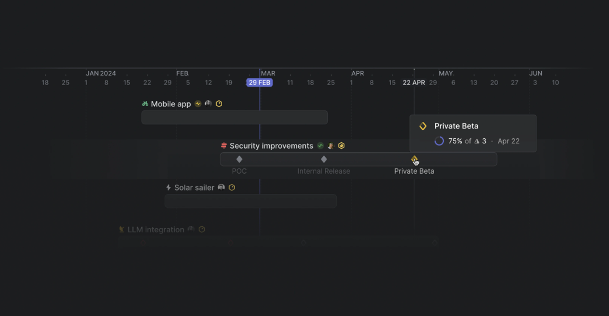

# 项目页参考 · 先看真实产品，不改稿

查阅日期：2026-10-01。用户反馈当前项目页“总感觉有点不知道怎么用”，要求参考。这里只收集真实官网界面与候选组织方式，不表示用户已选方案，不改现有 HTML。

## 当前页的问题

根据用户截图：影视项目直接展开镜头交期矩阵，coding 项目只有一行里程碑；缺少明确的项目入口层次与常用操作。跨项目总览和单项目镜头明细混在一起，宽屏中镜头名与日期隔得太远。它更像结果报表，不是让人知道下一步做什么的操作页。

## 1. Kitsu · 镜头识别与制作状态

官方页面：https://www.cg-wire.com/kitsu （本次 GET 200）

- 可见：缩略图、镜头编号、帧信息、各制作环节状态及人员。
- 借鉴：镜头先有视觉身份，状态和任务围绕同一个镜头组织，避免只有编号与分散日期。
- 不照搬：大量部门列、人员分配和复杂制片字段；这是个人工作台。
- 注意：截图列是 Animatik / Layout / Animation 等制作环节，不等于用户的 BCOPY / BCOPY+ / FINAL 交付轮次；后者仍是三个独立交付节点。
- 图片原址：https://www.cg-wire.com/images/kitsu/track.png （200，image/png）。

审阅辅助图：[Kitsu-审阅.png](Kitsu-review.png)
- 原址：https://www.cg-wire.com/images/kitsu/review.png （200，image/png）。
- 只参考镜头与画面的关联，不由此新增视频播放器、时间线批注或团队审片系统。

## 2. Linear · 项目入口与项目内部信息

官方文档：https://linear.app/docs/board-layout 、https://linear.app/docs/projects （本次 GET 200）

- 可见：项目卡片有名称、目标说明、状态、时间与里程碑提示；先找到项目，而不是把所有项目的细项铺在同一页。
- 借鉴：项目入口与项目内部工作分层；影视 / coding 项目可共用入口，内部再采用不同对象（镜头 / 任务）。
- 不照搬：季度路线图、客户、团队、企业级 initiatives；用户只需要自己的工作。
- 图片原址：https://webassets.linear.app/images/ornj730p/production/2218608e9b124509700f975fb56df7af95e424dc-2560x1440.png?w=1600&q=90 （200，image/png）。

项目内部概览：[Linear-项目概览.png](Linear-project-overview.png)
- 原址：https://webassets.linear.app/images/ornj730p/production/5622bb57d625b2dbbe27639fe6f685e1c43589bd-2105x1332.png?w=1600&q=90 （200，image/png）。
- 可见项目描述、状态、日期、资源链接及更新。可以参考“项目资料放在项目内”，不是模仿图中的密集标签。

## 3. Linear · 时间线作为辅助视图

官方文档：https://linear.app/docs/project-milestones （本次 GET 200）

- 可见项目时间条及单独里程碑标记。
- 借鉴：检查多个交付节点的时间关系；可作为“交付日历 / 时间线”辅助，不必第一屏强制展示。
- 不能用一个项目结束日期替换每个镜头的独立交期。
- 原址：https://webassets.linear.app/images/ornj730p/production/59f96a11448bfb1bc23d25979f45975cfe8a8f28-1046x545.png?w=1440&q=90 （200，image/png）。

附带下载的 `Linear-任务看板.png` 是官网装饰性骨架图，没有真实任务文字，不作为可用性参考。原址：https://webassets.linear.app/images/ornj730p/production/04115ca5eb44c3c6fc38d9998e6a7af068cb8b61-3424x1920.png?w=1600&q=90 。

## 供讨论的组合，不是已确认需求

项目入口（进行中项目 + 最近交付 + 新建 / 导入资料）
→ 单项目页面（概览、镜头 / 任务、交付、资料）
→ 镜头或任务详情（当前要做的事、独立交付节点、版本 / 资料 / 更新）。

倾向借 Linear 的项目层级与 Kitsu 的镜头识别方式，而不是整套照搬其中一个产品；正常页面导航、不强迫弹窗的要求继续保留。

## 边界

以上是官方公开图片，仅供本地设计对照，版权属于各产品及图中内容权利方，不纳入 AZCine 产品素材或品牌资产。没有登录产品、试运行工作流或确认当前账号功能。截图可见内容与真实交互能力分开，不凭静态图承诺拖拽、视频审阅或后台执行。

## 补充：ftrack Studio · 完整的三级组织

只读 scout sa-8 已返回官方来源；主代理另行下载三张图片（匿名 GET 200，image/png）并打开核对。

1. [项目入口截图](ftrack-project-index.png)：项目卡片有名称、类型、状态和日期，侧栏有最近项目；上方可见 Card / List / Timeline。借鉴“先选项目”的入口，不照搬工作室规模的项目墙。
   - 图片：https://help.ftrack-studio.backlight.co/hc/article_attachments/34682584505623
   - 来源：https://help.ftrack-studio.backlight.co/hc/en-us/articles/34672954066071
2. [镜头任务截图](ftrack-shot-tasks.png)：镜头缩略图与编号，制作环节状态，以及 Create / Import / Filter 等明确动作。借鉴“对象旁边有操作”，不照搬密集工种彩色列。
   - 图片：https://help.ftrack-studio.backlight.co/hc/article_attachments/38945445225239
   - 来源：https://help.ftrack-studio.backlight.co/hc/en-us/articles/13129840804375
3. [任务更新截图](ftrack-task-update.png)：单项工作的状态、日期、Notes、反馈与版本信息聚合。借鉴信息归属，不照搬侧边叠层；AZCine 仍按用户要求优先正常详情页。
   - 图片：https://help.ftrack-studio.backlight.co/hc/article_attachments/38785065393047
   - 来源：https://help.ftrack-studio.backlight.co/hc/en-us/articles/13130003417751

scout 报告官方帮助 HTML 返回403，通过官方公开文章接口核对。主代理此次只核对图片，不声称帮助页面已直接访问成功或已登录试用。三张中的教学标记为官方原图内容。BCOPY / BCOPY+ / FINAL 仍保留独立节点，不因制作环节示例而合并。

当前仍是参考讨论，未修改项目原型。
